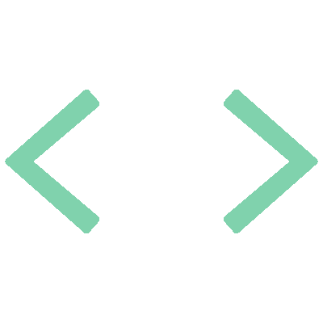

<!-- Main Header -->
<h2 align="center">
  Hello, Welcome to My Profile! 
</h2>

<!-- Sub-header -->

  

<!-- About Me -->

My name is **Ethan Schmidt**, I'm a web developer from Calgary, Alberta, with a
background in mathematical sciences. I enjoy building both front-end and
full-stack web applications, where I mainly focus on core web technologies and
the MERN stack.

<!-- # Projects -->
<!-- <table align="center"> -->
<!--   <tbody> -->
<!--     <tr> -->
<!--       <td> -->
<!--         <a href="https://github.com/CS-Schmidt/coin-market-tracker"> -->
<!--            -->
<!--         </a> -->
<!--       </td> -->
<!--       <td> -->
<!--         <a href="https://github.com/CS-Schmidt/portfolio-website"> -->
<!--            -->
<!--         </a> -->
<!--       </td> -->
<!--     </tr> -->
<!--     <tr> -->
<!--       <td> -->
<!--         <a href="https://github.com/CS-Schmidt/netflix-clone"> -->
<!--          -->
<!--         </a> -->
<!--       </td> -->
<!--       <td> -->
<!--         <a href="https://github.com/CS-Schmidt/campsight"> -->
<!--            -->
<!--         </a> -->
<!--       </td> -->
<!--     </tr> -->
<!--   </tbody> -->
<!-- </table> -->

# Languages and Tools

<table>
  <tbody>
    <tr>
      <td>
        
      </td>
      <td>
        
        
        
        
        
        
        
        
        
        
        
        
        
        
        
        
        
      </td>
    </tr>
  </tbody>
</table>

# GitHub Stats

<table>
  <tbody>
    <tr>
      <td>
        
      </td>
      <td>
        
      </td>
    </tr>
  </tbody>
</table>
