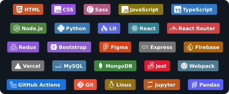

<!-- HEADER -->

  <!-- Profile Views Badge -->
  

<!-- HEADING -->
<h1 align="center">
  Hello, Thanks for Stopping By!
  
</h1>
<!-- SUBHEADING -->

  

<!-- Vertical Spacer -->

<!-- CANDIDATE PROFILE -->

  My name is <b>Ethan</b>, and I'm a web developer with a background in mathematical
  sciences, based in Calgary, Alberta 🏴󠁣󠁡󠁡󠁢󠁿. I build clean, responsive, and performant web
  applications&mdash;from front-end to full-stack systems.

<!-- Vertical Spacer -->
<h2></h2>

<!-- SKILLS -->

  <!-- GitHub Language Usage Card -->
  
    <picture>
      <source
        media="(prefers-color-scheme: light)"
        srcset="https://github-readme-stats-phi-ashen-90.vercel.app/api/top-langs?username=cs-schmidt&layout=compact&theme=vue&hide_border=false&border_radius=10&langs_count=8&custom_title=Top+Languages+Used" />
      <source
        media="(prefers-color-scheme: dark)"
        srcset="https://github-readme-stats-phi-ashen-90.vercel.app/api/top-langs?username=cs-schmidt&layout=compact&theme=vue-dark&hide_border=true&border_radius=10&langs_count=8&custom_title=Top+Languages+Used" />
      
    </picture>
  
  <!-- Top Skills Card -->
  
    <picture>
      <source 
        media="(prefers-color-scheme: light)"
        srcset="assets/skills-card_light.svg"/>
      <source 
        media="(prefers-color-scheme: dark)"
        srcset="assets/skills-card_dark.svg"/>
      
    </picture>
  

<!-- GITHUB STATS -->

  <!-- GitHub Activity Stats -->
  
    <picture>
      <source
        media="(prefers-color-scheme: light)" 
        srcset="https://github-readme-stats-phi-ashen-90.vercel.app/api?username=cs-schmidt&theme=vue&card_width=437&hide_border=false&border_radius=12&show_icons=true&rank_icon=github&text_bold=false&custom_title=Personal+GitHub+Stats" />
      <source
        media="(prefers-color-scheme: dark)" 
        srcset="https://github-readme-stats-phi-ashen-90.vercel.app/api?username=cs-schmidt&theme=vue-dark&card_width=437&hide_border=true&border_radius=12&show_icons=true&rank_icon=github&text_bold=false&custom_title=Personal+GitHub+Stats" />
      
    </picture>
  
  <!-- GitHub Streak Stats -->
  
    <picture>
      <source
        media="(prefers-color-scheme: light)" 
        srcset="https://github-readme-streak-stats-chi-bay.vercel.app/?user=cs-schmidt&theme=vue&card_width=381&card_height=170&hide_border=false&border_radius=10&border=e4e2e2&stroke=e4e2e2" />
      <source
        media="(prefers-color-scheme: dark)" 
        srcset="https://github-readme-streak-stats-chi-bay.vercel.app/?user=cs-schmidt&theme=vue-dark&card_width=381&card_height=170&hide_border=true&border_radius=10" />
      
    </picture>
  

